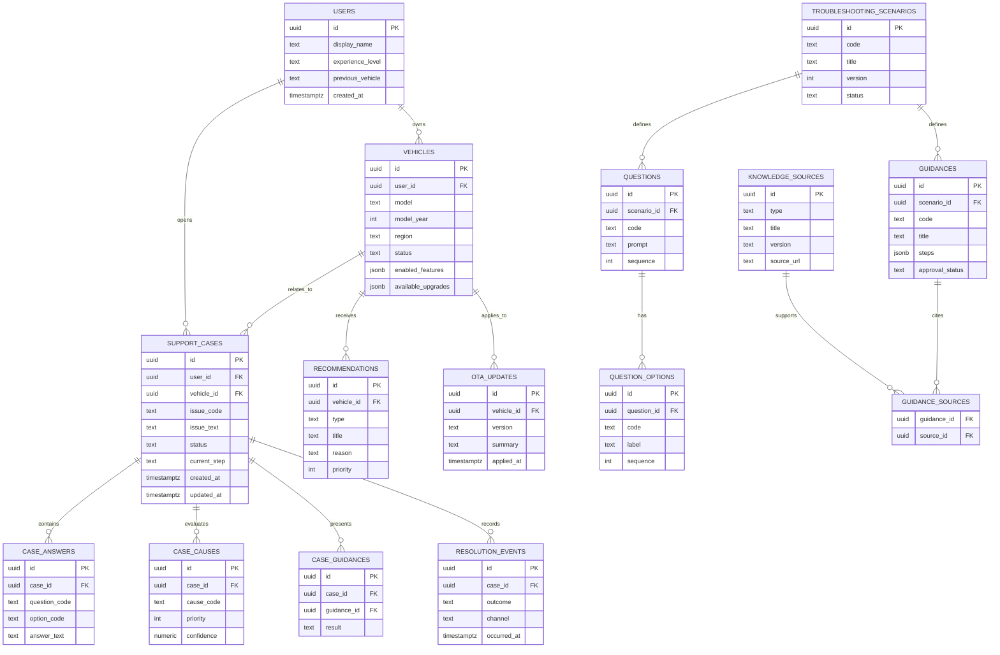

# データベース設計書

| 項目 | 内容 |
|---|---|
| 文書名 | コンシェルジュAPP（デジOM）データベース設計書 |
| 版 | 0.1 |
| 作成日 | 2026-08-10 |
| 出典 | `docs/output/detailed_requirements_specification.md` 7. データベース設計 |

## 1. 設計方針

- モックMVPでは、本設計と同一構造を持つTypeScript/JSON fixtureを利用し、DBを実行時の必須依存としない。
- 本設計はPoC以降にSupabase（PostgreSQL）へそのまま移行できる論理モデルとして定義する。
- 主キーはUUID、日時は`timestamptz`、半構造データ（手順・機能一覧等）は`jsonb`を用い、検索・集計対象の項目は正規化されたカラムとして持つ。
- 実ユーザーを扱うPoC以降では、PII（個人識別情報）を含むテーブルと、利用・解決ログを含むテーブルを論理的に分離し、アクセス制御・保持方針を個別に設定できるようにする。
- すべてのテーブルは`created_at`（および更新があるものは`updated_at`）を持つことを基本とする。

## 2. ER図

## 3. テーブル定義

### 3.1 `users`

車両オーナー（デモユーザー）を表す。

| カラム | 型 | Null | 制約・説明 |
|---|---|---|---|
| id | uuid | No | PK、既定値 `gen_random_uuid()` |
| display_name | text | No | 表示名（デモ用の名称） |
| experience_level | text | No | `new` \| `experienced` |
| previous_vehicle | text | Yes | 過去車両（習熟度判定・推薦理由に利用） |
| created_at | timestamptz | No | 既定値 `now()` |

**リレーション:** 1人のユーザーは複数の`vehicles`（通常はデモ上1台）、複数の`support_cases`を持つ。

### 3.2 `vehicles`

車両プロファイルおよび現在状態を表す。

| カラム | 型 | Null | 制約・説明 |
|---|---|---|---|
| id | uuid | No | PK |
| user_id | uuid | No | FK `users.id` |
| model | text | No | 車種（例: `bZ4X`） |
| model_year | int | No | 年式 |
| region | text | Yes | 地域仕様。(仮定) 未確定のためNull許容 |
| status | text | No | `normal` \| `attention` \| `warning` |
| enabled_features | jsonb | No | 有効な機能一覧 |
| available_upgrades | jsonb | No | 追加可能なアップグレードサービス一覧 |

**インデックス:** `(user_id)`。

**リレーション:** 1台の車両は複数の`support_cases`、`recommendations`、`ota_updates`に関連する。

### 3.3 `support_cases`

困りごと相談のケース本体。Owner UIとAgent UIで共有される中心テーブル。

| カラム | 型 | Null | 制約・説明 |
|---|---|---|---|
| id | uuid | No | PK、`gen_random_uuid()` |
| user_id | uuid | No | FK `users.id` |
| vehicle_id | uuid | No | FK `vehicles.id` |
| issue_code | text | No | 対象シナリオ識別子（例: `rear_door_not_open`） |
| issue_text | text | No | ユーザー入力そのもの |
| status | text | No | `in_progress` \| `solved` \| `not_solved` \| `escalated` |
| current_step | text | Yes | 現在の質問コードまたは画面ID |
| created_at | timestamptz | No | 既定値 `now()` |
| updated_at | timestamptz | No | 更新時に変更（トリガーまたはアプリ側で更新） |

**インデックス:** `(vehicle_id, created_at desc)`、`(status, updated_at desc)`。

**リレーション:** 1ケースは複数の`case_answers`、`case_causes`、`case_guidances`、`resolution_events`を持つ。Agent UIの`A02 Customer Case`はこのテーブルを主キー参照で取得する。

### 3.4 `case_answers`

状況確認（Clarification）でのユーザー回答履歴。

| カラム | 型 | Null | 制約・説明 |
|---|---|---|---|
| id | uuid | No | PK |
| case_id | uuid | No | FK `support_cases.id`、`ON DELETE CASCADE` |
| question_code | text | No | 質問コード（例: `opening_from`） |
| option_code | text | Yes | 選択肢コード（選択式の場合） |
| answer_text | text | Yes | 自由記述（該当する場合） |

**一意制約:** `(case_id, question_code)` — 同一ケース内で同一質問への回答は1件のみとする。「戻る」操作による回答変更はUPSERTで上書きする。

### 3.5 `case_causes`

診断（Diagnosis）で評価された原因候補。

| カラム | 型 | Null | 制約・説明 |
|---|---|---|---|
| id | uuid | No | PK |
| case_id | uuid | No | FK `support_cases.id`、`ON DELETE CASCADE` |
| cause_code | text | No | 原因コード（例: `child_protector`） |
| priority | int | No | 優先順位（昇順で評価・表示） |
| confidence | numeric | Yes | 確度（0.0〜1.0）。Agent UIの確度ラベル表示に使用 |

**インデックス:** `(case_id, priority)`。

### 3.6 `case_guidances`

ケースに対して提示された案内（Visual Guidance）とその結果。

| カラム | 型 | Null | 制約・説明 |
|---|---|---|---|
| id | uuid | No | PK |
| case_id | uuid | No | FK `support_cases.id`、`ON DELETE CASCADE` |
| guidance_id | uuid | No | FK `guidances.id` |
| result | text | Yes | 表示後の結果（例: `viewed`, `completed`） |

### 3.7 `resolution_events`

解決確認・対応結果の記録。CX Intelligenceの集計元データ。

| カラム | 型 | Null | 制約・説明 |
|---|---|---|---|
| id | uuid | No | PK |
| case_id | uuid | No | FK `support_cases.id`、`ON DELETE CASCADE` |
| outcome | text | No | `solved` \| `not_solved` \| `need_info` \| `escalated` |
| channel | text | No | `owner` \| `call_center` \| `dealer` |
| occurred_at | timestamptz | No | 既定値 `now()` |

**インデックス:** `(channel, occurred_at)` — CX Dashboardの件数・比率集計に利用。

### 3.8 `troubleshooting_scenarios`

トラブルシューティングのシナリオ定義（バージョン管理対象）。

| カラム | 型 | Null | 制約・説明 |
|---|---|---|---|
| id | uuid | No | PK |
| code | text | No | Unique（例: `rear_door_not_open`） |
| title | text | No | シナリオ名 |
| version | integer | No | 1以上、更新時にインクリメント |
| status | text | No | `draft` \| `approved` \| `retired` |

**リレーション:** 1シナリオは複数の`questions`、`guidances`を持つ。`support_cases.issue_code`は本テーブルの`code`と対応する。

### 3.9 `questions`

シナリオ内の質問定義。

| カラム | 型 | Null | 制約・説明 |
|---|---|---|---|
| id | uuid | No | PK |
| scenario_id | uuid | No | FK `troubleshooting_scenarios.id` |
| code | text | No | シナリオ内でUnique（例: `opening_from`） |
| prompt | text | No | 質問文 |
| sequence | int | No | 表示順（分岐がある場合は判定ロジック側で制御） |

### 3.10 `question_options`

質問の選択肢定義。

| カラム | 型 | Null | 制約・説明 |
|---|---|---|---|
| id | uuid | No | PK |
| question_id | uuid | No | FK `questions.id` |
| code | text | No | 質問内でUnique（例: `inside`, `outside`） |
| label | text | No | 表示ラベル（例: 「車内から」） |
| sequence | int | No | 表示順 |

### 3.11 `guidances`

案内（Visual Guidance）の定義。手順は`jsonb`で保持。

| カラム | 型 | Null | 制約・説明 |
|---|---|---|---|
| id | uuid | No | PK |
| scenario_id | uuid | No | FK `troubleshooting_scenarios.id` |
| code | text | No | シナリオ内でUnique（例: `check_child_protector`） |
| title | text | No | ガイド名 |
| steps | jsonb | No | 手順・画像・注意事項の配列（`GuidanceStep[]`相当） |
| approval_status | text | No | `draft` \| `reviewed` \| `approved` |

**運用ルール:** `steps`はアプリ側でスキーマ検証を行い、`approval_status = 'approved'`以外はOwner向け本番表示に使用しない（非機能要件 6.4 正確性・安全性）。

### 3.12 `knowledge_sources`

根拠情報（Owner's Manual、FAQ、過去事例など）のメタデータ。

| カラム | 型 | Null | 制約・説明 |
|---|---|---|---|
| id | uuid | No | PK |
| type | text | No | `owners_manual` \| `faq` \| `support_case` \| `product_info` |
| title | text | No | ソース名 |
| version | text | Yes | マニュアル等の版情報 |
| source_url | text | Yes | 参照元URLまたは社内パス |

### 3.13 `guidance_sources`（中間テーブル）

案内と根拠情報の多対多関連。

| カラム | 型 | Null | 制約・説明 |
|---|---|---|---|
| guidance_id | uuid | No | FK `guidances.id` |
| source_id | uuid | No | FK `knowledge_sources.id` |

**複合PK:** `(guidance_id, source_id)`。

### 3.14 `recommendations`

For You / Upgrade Recommendationの推薦データ。

| カラム | 型 | Null | 制約・説明 |
|---|---|---|---|
| id | uuid | No | PK |
| vehicle_id | uuid | No | FK `vehicles.id` |
| type | text | No | `onboarding` \| `feature` \| `ota` \| `upgrade` |
| title | text | No | 推薦タイトル |
| reason | text | No | 推薦理由（Owner向け表示文） |
| priority | int | No | 表示優先度（昇順） |

**インデックス:** `(vehicle_id, priority)` — Home画面表示順の決定論性を担保。

### 3.15 `ota_updates`

What's New（OTA更新）情報。

| カラム | 型 | Null | 制約・説明 |
|---|---|---|---|
| id | uuid | No | PK |
| vehicle_id | uuid | No | FK `vehicles.id` |
| version | text | No | ソフトウェアバージョン |
| summary | text | No | 変更概要 |
| applied_at | timestamptz | No | 適用日時 |

## 4. データ整合性・運用ルール

- すべての外部キーは参照整合性を持ち、`support_cases`に依存する子テーブル（`case_answers`, `case_causes`, `case_guidances`, `resolution_events`）は`ON DELETE CASCADE`とする。
- `troubleshooting_scenarios`・`guidances`は版管理（`version`, `approval_status`）を持ち、承認前のシナリオ・案内はOwner UIの本番表示経路で使用しない。
- Supabase採用時は、全公開テーブルでRow Level Security（RLS）を有効化し、Owner/Agent/Manufacturerの各ロールに応じた読み取り・更新権限を設定する（非機能要件 6.3）。
- 実データ運用（PoC以降）では、`users`テーブルのPIIを他ログテーブルと分離し、保持期間・削除方針をテーブル単位で定義する。
- モックMVPでは本設計に対応するfixtureデータ（`data/fixtures/`）をこのER図と同一の型定義で管理し、Supabase移行時にマイグレーションSQLへ変換できる状態を保つ。
