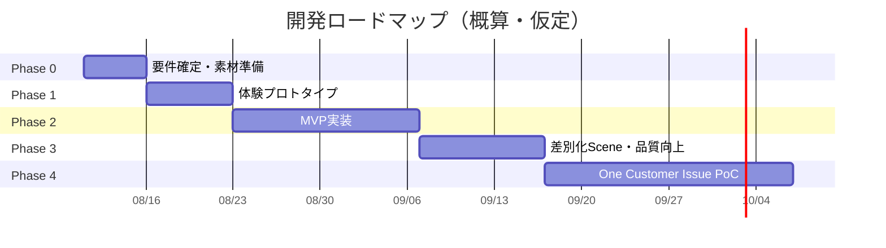

# 開発計画書

| 項目 | 内容 |
|---|---|
| 文書名 | コンシェルジュAPP（デジOM）開発計画書 |
| 版 | 0.1 |
| 作成日 | 2026-08-10 |
| 出典 | `docs/output/detailed_requirements_specification.md` 3.3 MVP定義、10. リスクと課題／`docs/output/system_requirements.md` 開発ロードマップ |

> **注記:** `detailed_requirements_specification.md` には「8. 開発プロセス／スケジュール」という章が存在せず、該当情報は同ファイルの章構成上「8. インテグレーション要件」に置き換わっている。本書のロードマップ・フェーズ情報は、上位文書である `docs/output/system_requirements.md` の「開発ロードマップ」を主要出典とし、`detailed_requirements_specification.md` の3.3 MVP定義・10. リスクと課題で補完した。

## 1. MVPの定義

`detailed_requirements_specification.md` 3.3節に基づき、MVPは以下の一気通貫フローを完走できることを最小要件とする。

1. Owner Homeでプロアクティブ推薦を確認する（U01）。
2. 「後席のドアが開かない」を入力する（U05）。
3. 「どこから」「どのドア」を回答する（U06）。
4. 原因候補と視覚的ガイドを確認する（U07, U08）。
5. 未解決を選択し、引き継ぎ要約を確認する（U09, U10）。
6. Agent UIで確認済み内容、次の質問、原因候補、根拠を確認する（A02〜A05）。
7. 対応結果を記録する（A06）。

**MVPスコープ外（後続フェーズで対応）:** 実AI連携、実データ連携、CX Intelligence（U/M系ダッシュボード）、決済、音声入力。OTA（U03）・Upgrade Recommendation（U04）はMVP後の差別化Sceneとして扱う。

## 2. 開発ロードマップ

### Phase 0：要件確定・素材準備（3〜5営業日）

- デモ対象車種・年式、正式マニュアル、ブランドガイドを確定する。
- 10〜15分の台本、必須Scene、画面文言、デモ成功条件を承認する。
- 車両画像・操作箇所画像の利用権を確認する。

**根拠:** 誤った車両案内と後工程のUI手戻りが最大の初期リスクであるため。

### Phase 1：体験プロトタイプ（1週間）

- デザイン方針、Owner Home、困りごと解決フロー、Agent 2カラム画面を作成する。
- 顧客レビューでコンセプトが伝わるかを確認する。

**完了条件:** クリック可能な主要フローで「検索ではなくFit」「回答ではなく解決」が説明できる。

### Phase 2：MVP実装（2〜3週間）

- Owner UI、共通Troubleshooting Engine、Support Handover、Agent Assistを実装する。
- 固定シナリオ、リセット、直接遷移、レスポンシブ対応を追加する。
- 単体テストと主要E2Eテストを作成する。

**根拠:** デモの核となる一気通貫体験を先に完成させ、技術依存を抑えるため。

### Phase 3：差別化Scene・品質向上（1〜2週間）

- OTA、Upgrade Recommendation、CX Intelligenceを追加する。
- アニメーション、車両イラスト、30秒動画風UI、アクセシビリティを調整する。
- 台本に沿ったリハーサル、回線断・誤操作時の復旧試験を行う。

**完了条件:** 15分以内で完走し、3回連続のリハーサルで重大な不具合が発生しない。

### Phase 4：One Customer Issue PoC（別フェーズ・別途スコープ）

- 実ナレッジの構造化、検索品質、回答根拠、自己解決率、Agent支援効果を検証する。
- 限定ユーザー・限定担当者で運用し、安全性・個人情報・監査要件を評価する。

**暫定KPI:** 対象問い合わせの正しい根拠提示率、タスク完了率、自己解決率、平均処理時間、再問い合わせ率、ユーザー／担当者満足度。目標値は現状ベースライン取得後に設定する。

> 日付・期間は仮定であり、Phase 0の要件確定結果（体制・予算・納期）に応じて再計画する。

## 3. タスク分解（WBS）

### 3.1 Phase 1：体験プロトタイプ

| ID | タスク | 関連要件 |
|---|---|---|
| T1-01 | デザインシステム定義（カラー、タイポグラフィ、コンポーネントトークン） | UI/UX設計 2 |
| T1-02 | Next.jsプロジェクト初期化、Tailwind、ESLint、TypeScript strict設定 | 非機能要件 6.6 |
| T1-03 | Owner Homeの静的プロトタイプ（U01） | FR-01 |
| T1-04 | 困りごと解決フローの画面遷移プロトタイプ（U05〜U09） | FR-05〜FR-08 |
| T1-05 | Agent 2カラム画面の静的プロトタイプ（A02〜A05） | FR-10 |
| T1-06 | 顧客レビュー用デモ台本ドラフト作成 | 1.4 成果物 |

### 3.2 Phase 2：MVP実装

| ID | タスク | 関連要件 |
|---|---|---|
| T2-01 | 型定義（`types/`）：User, Vehicle, SupportCase, Recommendation, KnowledgeSource等 | データベース設計 |
| T2-02 | Fixtureデータ作成（デモユーザー、bZ4X車両、シナリオ、根拠情報） | 1.5 制約と仮定 |
| T2-03 | Repository Interfaceおよび Fixture実装 | システムアーキテクチャ 5 |
| T2-04 | Troubleshooting Engine（判定ルール、状態遷移）実装 | FR-06、4.2 |
| T2-05 | Route Handler実装：`support-cases`作成／回答／解決結果／引き継ぎ | API仕様 4 |
| T2-06 | Owner UI実装：Home, Issue Input, Clarification, Diagnosis, Visual Guidance, Resolution Check | FR-01, FR-05〜FR-08 |
| T2-07 | Support Handover実装（Owner→Agentのケース共有） | FR-09 |
| T2-08 | Agent Assist実装：Next Best Question, Possible Causes, Recommended Guidance, Evidence, Resolution | FR-10 |
| T2-09 | デモ運営機能：Scene直接遷移、初期化 | FR-12 |
| T2-10 | 単体テスト（Troubleshooting Engine、Repository） | 非機能要件 6.6 |
| T2-11 | 主要フローE2Eテスト（Playwright） | 非機能要件 6.6 |
| T2-12 | アクセシビリティ基礎対応（コントラスト、フォーカス、代替テキスト） | 非機能要件 6.5 |

### 3.3 Phase 3：差別化Scene・品質向上

| ID | タスク | 関連要件 |
|---|---|---|
| T3-01 | What's New（OTA）実装 | FR-03 |
| T3-02 | Upgrade Recommendation実装 | FR-04 |
| T3-03 | CX Intelligence（CX Dashboard, Insight, Knowledge Improvement）実装 | FR-11 |
| T3-04 | モーション・車両イラスト・動画風UIの調整 | UI/UX設計 2.4 |
| T3-05 | `prefers-reduced-motion`対応、アクセシビリティ最終確認 | 非機能要件 6.5 |
| T3-06 | デモリハーサル（3回連続）、復旧手順の確立 | 非機能要件 6.2 |
| T3-07 | ローカル実行手順・静的バックアップの整備 | 11.5 バックアップ・障害対応 |

### 3.4 横断タスク

| ID | タスク | 関連要件 |
|---|---|---|
| TX-01 | CI設定（lint, typecheck, unit test, E2E, build） | 非機能要件 6.6 |
| TX-02 | Vercelデプロイ設定（Preview / production-demo） | 11.2 環境 |
| TX-03 | デモ台本の最終化とタイムテーブル確認 | 1.4 成果物 |
| TX-04 | 車両操作案内の承認プロセス実施 | 6.4 正確性・安全性 |

## 4. リスク管理

`detailed_requirements_specification.md` 10節のリスク一覧を転記し、開発計画上の対応タイミングを付記する。

| ID | 分類 | リスク／課題 | 影響 | 発生可能性 | 対策 | 対応フェーズ |
|---|---|---|---|---|---|---|
| R-01 | 安全 | 車種・年式に合わない操作案内 | 高 | 中 | 正式マニュアル、版管理、製品責任者承認 | Phase 0 |
| R-02 | 技術 | 外部AI・API障害でデモ停止 | 高 | 中 | 固定シナリオ、タイムアウト、フォールバック | Phase 2 |
| R-03 | 技術 | 状態分岐が破綻する | 高 | 中 | 状態遷移の明示、単体・E2Eテスト | Phase 2 |
| R-04 | 技術 | OwnerとAgentで情報不整合 | 高 | 低 | 共通caseId、共通Repository、契約テスト | Phase 2 |
| R-05 | UX | AIチャットにしか見えない | 高 | 中 | Home推薦、理由、解決確認、CX改善を強調 | Phase 1〜3 |
| R-06 | 事業 | 将来機能が実装済みに見える | 中 | 中 | モック／PoC／本番の境界表示 | Phase 1〜3 |
| R-07 | 事業 | KPIベースラインがなくPoC評価不能 | 高 | 高 | PoC前に現状計測と成功条件合意 | Phase 4 |
| R-08 | 法務 | 実データ・AI利用がポリシー違反 | 高 | 中 | 架空データ、事前審査、最小化、契約確認 | Phase 0, 4 |
| R-09 | 法務 | ロゴ・車両画像・図版の権利問題 | 高 | 中 | 利用許諾確認、仮素材の利用 | Phase 0 |
| R-10 | 運用 | ショールーム端末・回線差 | 高 | 中 | 実機試験、ローカル版、代替動画 | Phase 3 |
| R-11 | 運用 | 説明者の操作ミス | 中 | 中 | 台本、Scene移動、初期化、復旧手順 | Phase 3 |
| R-12 | 計画 | スコープ膨張 | 高 | 高 | MoSCoW、MVP凍結、変更管理 | 全フェーズ |

### 4.1 リスクレビュー方針

- Phase 0完了時点でR-01, R-08, R-09（安全・法務系）の状況を再評価し、未解消の場合はPhase 1開始判断をエスカレーションする。
- Phase 2完了時点でR-02〜R-04（技術系）をE2Eテスト結果で検証する。
- Phase 3完了時点でR-05, R-06, R-10, R-11（UX・運用系）をリハーサルで検証する。
- R-07（PoC評価不能）はPhase 4開始前に必ずベースライン計測と成功条件の合意を完了する。

## 5. マイルストーンと受入条件

| マイルストーン | 完了条件 |
|---|---|
| M0: 要件確定完了 | 対象車種・マニュアル版・ブランドガイド・台本が承認される |
| M1: プロトタイプレビュー完了 | 顧客レビューで主要コンセプトが説明できる |
| M2: MVP完成 | 一気通貫フロー（本書1節）が単体・E2Eテスト込みで完走する |
| M3: デモ品質完成 | 15分以内完走、3回連続リハーサル成功 |
| M4: PoC開始判断 | KPIベースラインと成功条件が合意される |
