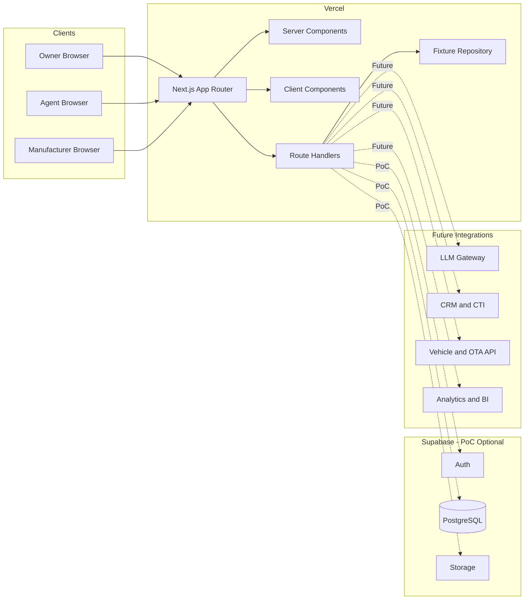
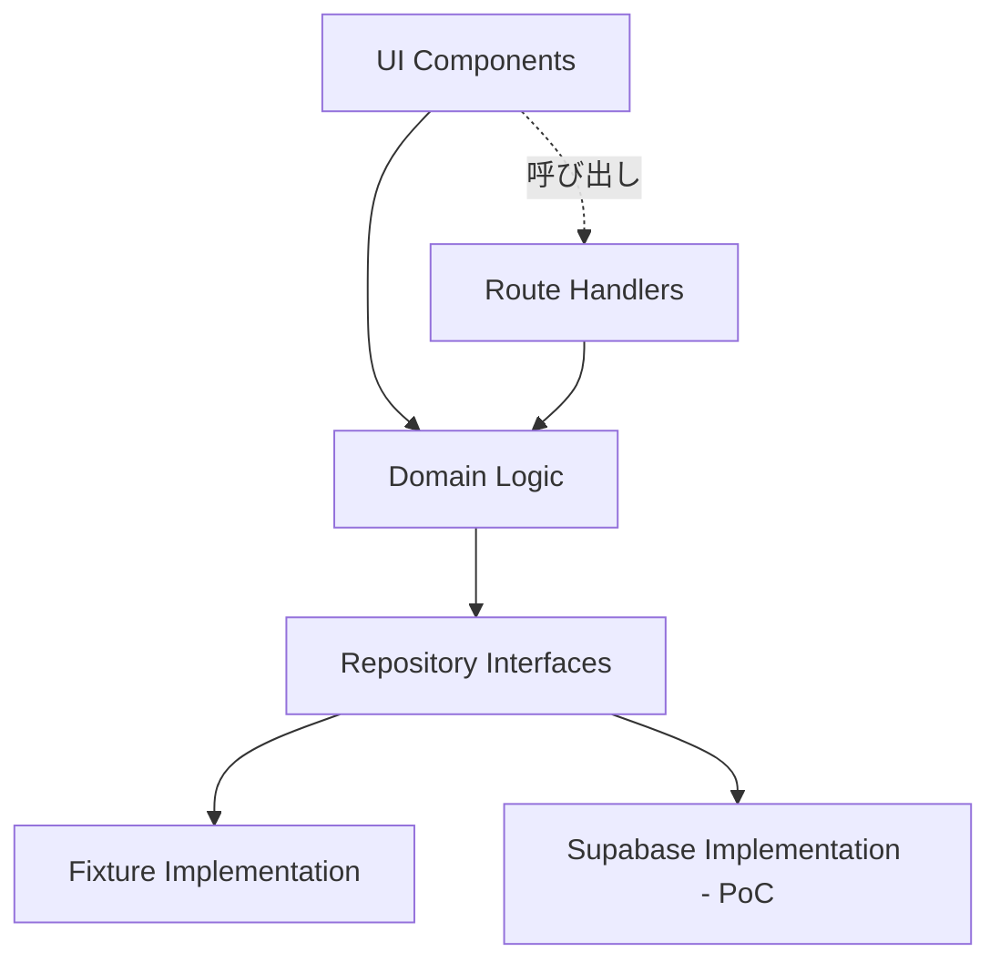
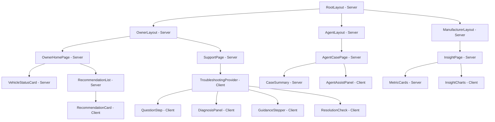

# システムアーキテクチャ設計書

| 項目 | 内容 |
|---|---|
| 文書名 | コンシェルジュAPP（デジOM）システムアーキテクチャ設計書 |
| 版 | 0.1 |
| 作成日 | 2026-08-10 |
| 出典 | `docs/output/detailed_requirements_specification.md` 9. 技術選定とアーキテクチャ |

## 1. アーキテクチャ方針

本システムは、ショールームデモの安定性を最優先し、**Next.js（App Router）+ TypeScript** を中核に、**Vercel** へ配備する単一Webアプリケーションとして構成する。データ永続化・認証基盤として **Supabase** を将来（PoC以降）の選択肢として組み込めるよう、Repositoryパターンでデータアクセスを抽象化する。

- モックMVPでは外部依存を持たない固定fixtureデータで動作させ、デモの再現性・耐障害性を確保する。
- Supabase・LLM・CRM/CTI・実車APIなどの外部連携は、Route Handlerの背後に隠蔽し、Repository/Adapter層の実装差し替えのみで有効化できる構成とする。
- Owner UI・Agent UI・Manufacturer UIは同一アプリ内の異なるルートセグメントとし、共通のドメインロジック（Troubleshooting / Recommendation / Context Engine）を共有する。

## 2. 技術スタックと選定理由

| レイヤー | 技術 | 選定理由 |
|---|---|---|
| Webフレームワーク | Next.js（App Router） | Server Components / Client Componentsの分離、Route HandlerによるREST API実装、Vercelとの一体運用、Owner/Agent/Manufacturerの複数UIを単一リポジトリで管理できる |
| 言語 | TypeScript（`strict: true`） | 共通型（`types/`）をUI・ドメインロジック・API間で共有し、実装時エラーを削減する |
| UIスタイリング | Tailwind CSS | デザイントークン（カラーパレット・タイポグラフィ）の統一、短期間でのUI実装に適する |
| 状態管理 | React Context + `useReducer`（ケース単位） | トラブルシューティングのような明示的な状態遷移を、決定論的かつテスト容易な形で管理できる |
| BaaS / DB（PoC以降） | Supabase（Auth, PostgreSQL, Storage） | Auth・DB・Storageを一体運用でき、PoC移行時の開発速度を確保できる。RLSによるアクセス制御も可能 |
| ホスティング | Vercel | Next.jsとのネイティブ統合、Preview Deployment、Edge/CDN配信によりショールームデモに十分な性能を確保 |
| テスト | Vitest + Testing Library、Playwright | ドメインロジックの単体テストとUI・E2Eテストを分担する |

> **注記:** モックMVPでは、SupabaseはRepository Interfaceの実装候補として保持するが、必須の実行時依存にはしない。デモの安定性（非機能要件 NFR-P04, 6.2 可用性）を優先し、既定はFixture Repositoryとする。

## 3. アーキテクチャ概要図



### 3.1 コンポーネントの役割

| コンポーネント | 役割 |
|---|---|
| Owner / Agent / Manufacturer Browser | それぞれ車両オーナー、コールセンター担当者、メーカー担当者が利用するクライアント。Owner はスマートフォン幅、Agent/Manufacturer はPC幅を主要対象とする |
| Next.js App Router | ルーティング、レンダリング（Server/Client Components）、APIエンドポイント（Route Handlers）を単一アプリで提供する中核 |
| Server Components | データ取得・初期表示・秘密情報を扱う既定のコンポーネント種別。クライアントへJSを送らず高速表示を実現する |
| Client Components | ユーザー操作、状態遷移、アニメーションを扱う対話的な部品。`"use client"`境界は末端の対話コンポーネントに限定する |
| Route Handlers | `/api/v1/*` のRESTエンドポイントを実装し、Repository層を介してデータ操作・ドメインロジック呼び出しを行う |
| Fixture Repository | モックMVPの既定データアクセス実装。JSON/TypeScript固定データを返却し、外部依存なしで決定論的に動作する |
| Supabase（PoC） | 認証（Auth）、永続化（PostgreSQL）、素材配信（Storage）を提供する将来のバックエンド候補。Repository Interfaceを実装する形で差し替える |
| LLM Gateway（将来） | 自由入力の意図分類や要約生成に利用する候補。障害時は固定シナリオへフォールバックする前提で接続する |
| CRM/CTI、Vehicle/OTA API、Analytics/BI（将来） | それぞれケース引き継ぎ、車両状態取得、CX分析の本番連携候補。モックでは画面遷移・デモ値で代替する |

### 3.2 レイヤー構成と依存方向



- UIはドメインロジックを直接importせず、Route Handler経由のAPI、またはServer Component内でのドメイン呼び出しのみを行う。
- ドメインロジック（`domain/troubleshooting`, `domain/recommendation`, `domain/context`）はUIやHTTPの詳細に依存しない純粋なTypeScriptモジュールとする。
- Repository Interfaceを切り出すことで、Fixture実装とSupabase実装を無停止で切り替えられる。

## 4. ディレクトリ構成（App Router）

```text
src/
├─ app/
│  ├─ owner/
│  │  ├─ page.tsx
│  │  ├─ whats-new/page.tsx
│  │  ├─ upgrade/page.tsx
│  │  └─ support/[caseId]/
│  │     ├─ clarify/page.tsx
│  │     ├─ diagnosis/page.tsx
│  │     ├─ guidance/page.tsx
│  │     ├─ resolution/page.tsx
│  │     └─ handover/page.tsx
│  ├─ agent/
│  │  ├─ page.tsx
│  │  └─ cases/[caseId]/page.tsx
│  ├─ manufacturer/
│  │  └─ insights/page.tsx
│  └─ api/v1/support-cases/
├─ components/
│  ├─ owner/
│  ├─ agent/
│  ├─ troubleshooting/
│  └─ ui/
├─ domain/
│  ├─ context/
│  ├─ recommendation/
│  └─ troubleshooting/
├─ repositories/
│  ├─ fixture/
│  └─ supabase/
├─ data/fixtures/
└─ types/
```

## 5. コンポーネント設計

### 5.1 コンポーネント階層図



### 5.2 Server / Client Componentsの区分方針

| 方針 | 内容 |
|---|---|
| 既定 | すべてServer Componentから開始し、対話が必要な末端のみClient Componentへ切り出す |
| データ取得 | fixtureまたはSupabaseからの取得はServer Component／Route Handlerで行い、Client Componentへ生データではなく整形済みPropsを渡す |
| 秘密情報 | APIキー等はServer専用モジュール（`repositories/supabase`など）に閉じ、Client Componentへ渡さない |
| 状態境界 | ケース全体の状態（回答履歴、診断結果、現在ステップ）は`TroubleshootingProvider`（Client）が`useReducer`で保持し、子コンポーネントはPropsとコールバックのみを受け取る |
| 更新経路 | UIからの更新は必ずRoute Handler（`/api/v1/...`）を通す。本書ではServer Actionは採用せず、REST API公開要件に合わせてRoute Handlerに統一する |

### 5.3 主要コンポーネント仕様

#### `QuestionStep`（Client Component）

```typescript
type QuestionOption = {
  code: string;
  label: string;
};

type QuestionStepProps = {
  questionCode: string;
  prompt: string;
  options: QuestionOption[];
  selectedCode?: string;
  progress: { current: number; total: number };
  onAnswer: (questionCode: string, optionCode: string) => void;
  onBack?: () => void;
};
```

- **役割:** 状況確認（U06 Clarification）で1問ずつ質問と選択肢を表示する。
- **状態管理:** 自身はステートレスに近く、選択状態は`TroubleshootingProvider`の`useReducer`が単一の真実源として保持する。
- **Server/Client区分:** 選択・戻る操作・キーボード操作を扱うためClient Componentとする。
- **アクセシビリティ:** 選択肢は44px以上のタップ領域、ARIAラベル、フォーカスリングを持つボタンとして実装する。

#### `GuidanceStepper`（Client Component）

```typescript
type GuidanceStep = {
  id: string;
  title: string;
  body: string;
  imageUrl?: string;
  imageAlt?: string;
  warning?: string;
};

type GuidanceStepperProps = {
  title: string;
  steps: GuidanceStep[];
  onComplete: () => void;
};
```

- **役割:** Visual Guidance（U08）で3〜5ステップの操作案内を進行表示する。
- **状態管理:** 現在の表示ステップ番号のみをローカル`useState<number>`で保持し、ケース全体の状態はContext経由で親から参照する。
- **Server/Client区分:** ステップ送り・戻り操作、`prefers-reduced-motion`対応のアニメーション制御があるためClient Componentとする。
- **安全表示:** `warning`が設定されたステップは、本文より視覚的に優先する形式で表示する。

#### `AgentAssistPanel`（Client Component）

```typescript
type CauseCandidate = {
  code: string;
  label: string;
  priority: number;
  confidenceLabel?: "high" | "medium" | "low";
  evidenceIds: string[];
};

type AgentAssistPanelProps = {
  caseId: string;
  nextQuestion?: {
    prompt: string;
    reason: string;
  };
  causes: CauseCandidate[];
  recommendedTalk: string;
  onResolve: (outcome: "solved" | "not_solved" | "dealer" | "technical_support") => void;
};
```

- **役割:** Agent Assist（A03〜A05）でNext Best Question、原因候補、回答トーク、対応結果登録を1画面に統合表示する。
- **状態管理:** モックMVPでは`useState`で十分とし、複数パネルを横断した同期が必要になった場合のみ軽量ストア（Zustand等）を検討する。
- **Server/Client区分:** ケース初期データはAgentCasePage（Server）で取得し、以降の選択・結果登録操作を扱うAgentAssistPanelはClient Componentとする。
- **表示区別:** AIが提示した候補・提案と、Agentが確定した対応内容を視覚的に区別する（例: バッジ表示）。

## 6. 品質・運用に関するアーキテクチャ上の考慮

- **可用性:** Fixture Repositoryを既定とし、外部API（Supabase/LLM等）なしでMVPシナリオが完走できる構成にする（NFR: 6.2）。
- **保守性:** ドメインロジックをUIから分離し、Owner/Agentで診断ルールを重複実装しない（NFR: 6.6）。
- **セキュリティ:** 秘密情報は環境変数で管理し、Client Componentへ埋め込まない。Supabase採用時はRLSを全公開テーブルで有効化する（NFR: 6.3）。
- **テスト容易性:** Repository Interfaceによりドメインロジックをモック環境でテストでき、Route Handlerの契約テストも独立して実行できる。
- **将来拡張:** LLM Gateway、CRM/CTI、Vehicle/OTA APIはAdapterとしてRoute Handlerの背後に追加し、既存UI・ドメインロジックへの影響を最小化する。
