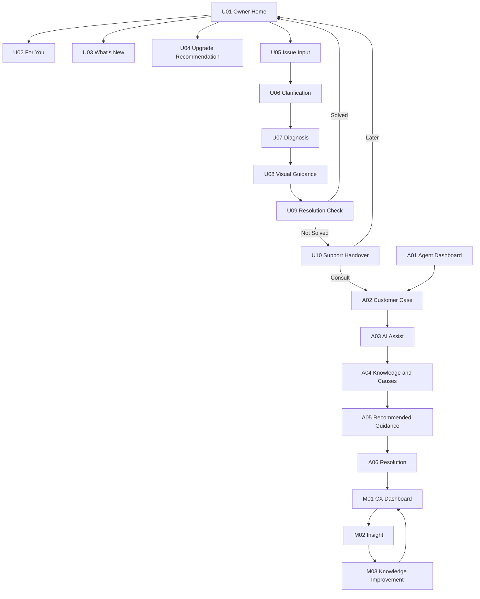

# UI/UX設計書

| 項目 | 内容 |
|---|---|
| 文書名 | コンシェルジュAPP（デジOM）UI/UX設計書 |
| 版 | 0.1 |
| 作成日 | 2026-08-10 |
| 出典 | `docs/output/detailed_requirements_specification.md` 5. UI/UX設計 |

## 1. デザインコンセプト

- **キーワード:** Premium（上質）、Minimal（削ぎ落とされた）、Contextual（文脈適応）、Trustworthy（信頼できる）
- **基本原則:** 画面情報は「状態 → 次の行動 → 理由」の順で提示し、ユーザーに考えさせる前に方向性を示す。
- **Owner UI:** モバイルファースト。大きな余白、明確なカード階層、片手操作を前提にした1画面1判断の構成とする。検索ボックスやチャット欄をホーム最上部の主役にしない。
- **Agent UI:** PCメイン。情報密度を保ちながら、次の質問・原因候補・根拠へ即時アクセスできる2カラム構成とする。
- **文体・トーン:** 短く、平易で、安心感がある表現とする。断定的な診断表現（「〜が原因です」）ではなく、「可能性があります」等の推測を示す表現を用いる。

### 1.1 デザインシステムの目的

車両が「検索されるデジタル取扱説明書」ではなく、「利用者を理解し先回りするコンシェルジュ」であることを、色・タイポグラフィ・レイアウト・モーションの全てで一貫して表現する。

## 2. デザインシステム

### 2.1 カラーパレット（仮定・ブランドガイド入手後に置換）

| 用途 | 色名 | HEX | 使用箇所の例 |
|---|---|---|---|
| Primary | Deep Navy | `#102A43` | ヘッダー、主要見出し、Agentサイドバー |
| Accent | Electric Blue | `#2F80ED` | プライマリボタン、リンク、選択状態 |
| Background | Cool White | `#F7F9FC` | 画面背景 |
| Surface | White | `#FFFFFF` | カード背景 |
| Success | Green | `#17864B` | 解決済み、正常状態バッジ |
| Attention | Amber | `#B76E00` | 注意事項、要確認バッジ |
| Danger | Red | `#C62828` | エラー、緊急案内 |
| Main Text | Charcoal | `#172B4D` | 本文・見出し文字色 |
| Secondary Text | Slate | `#5E6C84` | 補足説明、キャプション |

**運用ルール:**
- 本文・背景間のコントラストはWCAG 2.2 AA相当（通常テキストで4.5:1以上）を満たす。
- 状態表現（正常／注意／警告／エラー）は色だけに依存せず、アイコンと文言を必ず併用する。
- ブランドガイド入手後、Primary/Accentを中心に本パレットを差し替えるが、コントラスト基準は維持する。

### 2.2 タイポグラフィ（仮定）

| 用途 | フォント | サイズ / ウェイト |
|---|---|---|
| 日本語 | `"Noto Sans JP", system-ui, sans-serif` | — |
| 英数字 | `"Inter", "Noto Sans JP", sans-serif` | — |
| Display | 上記フォント | 28px / 700 |
| Heading 1 | 上記フォント | 24px / 700 |
| Heading 2 | 上記フォント | 20px / 700 |
| Body | 上記フォント | 16px / 400 |
| Caption | 上記フォント | 13px / 400 |
| Agent UI Body | 上記フォント | 14〜16px（情報密度を優先し本文をやや小さくする） |

### 2.3 レイアウト・グリッド方針

| UI | 対象幅 | 方針 |
|---|---|---|
| Owner UI | 360〜430px | 単一カラム、カードベース、余白を広めに確保 |
| Agent UI | 1280px以上 | 左（顧客・車両・ケース）／右（AI Assist）の2カラム固定 |
| 共通 | — | タップ領域44px以上、色以外の状態表現、`prefers-reduced-motion`尊重 |

### 2.4 モーション方針

- 推薦カードや診断ステップの切り替えには短いトランジション（100〜200ms程度）を用いる。
- 操作の待たせにつながる長いアニメーションは避ける。
- OS/ブラウザの「動きを減らす」設定（`prefers-reduced-motion: reduce`）を検出した場合はアニメーションを最小化する。

## 3. 画面一覧

| ID | 画面名 | 対象 | 目的 |
|---|---|---|---|
| U01 | Home | Owner | 車両状態とプロアクティブな情報提供の起点 |
| U02 | For You | Owner | ユーザー別おすすめの一覧・理由表示 |
| U03 | What's New | Owner | OTA・新機能の変更点通知 |
| U04 | Upgrade Recommendation | Owner | 適合サービスの推薦と理由表示 |
| U05 | Ask / Issue Input | Owner | 困りごと入力 |
| U06 | Clarification | Owner | 状況確認（逐次質問） |
| U07 | Diagnosis | Owner | 原因候補の提示 |
| U08 | Visual Guidance | Owner | 視覚的な操作案内 |
| U09 | Resolution Check | Owner | 解決結果の確認 |
| U10 | Support Handover | Owner | 有人支援への情報引き継ぎ |
| A01 | Agent Dashboard | Agent | 問い合わせ一覧 |
| A02 | Customer Case | Agent | 顧客・車両・問い合わせ情報の表示 |
| A03 | AI Assist | Agent | Next Best Questionの提示 |
| A04 | Knowledge / Cause | Agent | 原因候補・根拠の提示 |
| A05 | Recommended Guidance | Agent | 回答トーク・案内の提示 |
| A06 | Resolution | Agent | 対応結果の記録 |
| M01 | CX Dashboard | Manufacturer | 問い合わせ・解決状況の可視化 |
| M02 | Insight | Manufacturer | 問題傾向・改善点の提示 |
| M03 | Knowledge Improvement | Manufacturer | 情報改善候補の提示 |

## 4. 画面遷移図



### 4.1 画面ごとの役割補足

- **U01 Home:** 検索ボックスを主役にせず、「MY CAR（車両状態）→ FOR YOU → WHAT'S NEW → Recommended Services → Need Help?」の優先順位でカードを縦に配置する。
- **U05〜U09（トラブルシューティング）:** 「困りごと → 状況確認 → 原因候補 → 案内 → 解決確認」の一方向フローとし、各画面で「戻る」を提供して直前の回答を修正できるようにする。
- **U09→U10:** 「未解決」を選んだ場合のみSupport Handoverへ進み、「解決」の場合はHomeへ戻る。
- **U10→A02:** OwnerがAgentへ「相談する」を選んだ場合のみケースが`escalated`となり、Agent側で同一ケースが参照可能になる。
- **A02〜A06:** 左ペイン（顧客・車両・ケース）は静的表示中心、右ペイン（AI Assist〜Resolution）はAgentの操作に応じて更新される。
- **A06→M01→M02→M03→M01:** Agentの対応結果が集計され、CX Dashboard・Insight・Knowledge Improvementの循環を形成する（改善提案が実際に反映されるループはPoC以降）。

## 5. 主要画面ワイヤーフレーム

### 5.1 U01 Owner Home

```text
┌────────────────────────────────┐
│ Good afternoon          [Menu] │
│                                │
│ MY CAR                         │
│ ┌────────────────────────────┐ │
│ │ bZ4X        All Good  ●    │ │
│ │ Vehicle image / status     │ │
│ └────────────────────────────┘ │
│                                │
│ FOR YOU                        │
│ ┌────────────────────────────┐ │
│ │ おすすめ                    │ │
│ │ 充電スケジュールを設定する  │ │
│ │ 納車後に便利です       [>] │ │
│ └────────────────────────────┘ │
│                                │
│ WHAT'S NEW                     │
│ ┌────────────────────────────┐ │
│ │ Update completed / 2件 [>] │ │
│ └────────────────────────────┘ │
│                                │
│ [ 困りごとを相談する ]         │
│ Ask anything                   │
└────────────────────────────────┘
```

**配置コンポーネント:**

| コンポーネント | 内容 | Server/Client |
|---|---|---|
| `VehicleStatusCard` | 車種名、状態バッジ（All Good / 要確認 / 警告）、車両画像 | Server |
| `RecommendationList` → `RecommendationCard` | For You推薦カード（タイトル、理由、優先度、遷移先） | Server（一覧）／Client（カード内タップ操作） |
| `WhatsNewSummaryCard` | 更新完了メッセージ、関係する変更件数、詳細への導線 | Server |
| `AskAnythingButton` | 困りごと入力（U05）への主要導線。画面下部に固定配置し、検索ボックスのような見た目にしない | Client（タップ遷移） |

**インタラクション:**
- 各カードをタップすると対応する詳細画面（U02〜U04）へ遷移する。
- 「困りごとを相談する」は画面下部の目立つボタンとし、チャット入力欄のような常時表示テキストボックスにはしない。

### 5.2 U08 Visual Guidance

```text
┌────────────────────────────────┐
│ [<] 30秒で確認できます   1 / 3 │
│                                │
│ ┌────────────────────────────┐ │
│ │                            │ │
│ │  Vehicle / Door image      │ │
│ │  Left rear highlighted     │ │
│ │                            │ │
│ └────────────────────────────┘ │
│ STEP 1                         │
│ 後席ドアを開けます             │
│                                │
│ [ 戻る ]              [ 次へ ] │
└────────────────────────────────┘
```

**配置コンポーネント:**

| コンポーネント | 内容 | Server/Client |
|---|---|---|
| `GuidanceStepper` | 進行状況表示（1/3等）、車両イラスト＋対象箇所ハイライト、ステップ本文、前後ナビゲーション | Client |
| `SafetyWarningBanner`（該当時のみ） | 安全上の注意がある場合、手順本文より前に目立つ形式で表示 | Server（静的コンテンツ）または Client（動的挿入） |

**インタラクション:**
- 「次へ」で次ステップへ、「戻る」で前ステップまたは前画面（Diagnosis）へ戻る。
- 最終ステップの「次へ」はResolution Check（U09）へ遷移する。
- 画像には代替テキストを必須とし、読み込み失敗時は手順本文のみで理解できる文言にする。

### 5.3 A02〜A05 Agent Case（2カラムレイアウト）

```text
┌──────────────────────┬─────────────────────────────────┐
│ CUSTOMER / CASE      │ AI ASSIST                       │
│ Demo User            │ NEXT BEST QUESTION              │
│ bZ4X                 │ 車外から開けられますか？         │
│                      │ 理由: 原因候補の切り分け         │
│ ISSUE                ├─────────────────────────────────┤
│ 後席ドアが開かない    │ POSSIBLE CAUSES                 │
│                      │ 1. Child Protector              │
│ CHECKED              │ 2. Door Lock Setting            │
│ ✓ 車内から            ├─────────────────────────────────┤
│ ✓ 左後席              │ RECOMMENDED GUIDANCE            │
│ ✓ ガイド実施          │ 顧客向け回答トーク              │
│                      ├─────────────────────────────────┤
│ HISTORY              │ EVIDENCE                        │
│ ...                  │ Manual / FAQ / Past Case        │
└──────────────────────┴─────────────────────────────────┘
```

**配置コンポーネント:**

| コンポーネント | 内容 | Server/Client |
|---|---|---|
| `CaseSummary`（左ペイン） | 顧客名、車両、Issue、確認済み項目、履歴 | Server |
| `AgentAssistPanel`（右ペイン） | Next Best Question、Possible Causes、Recommended Guidance、Evidence、結果登録操作 | Client |

**インタラクション:**
- Next Best Questionへの回答（Agentがオペレーターとして選択）に応じて、Possible Causesの順序・Recommended Guidanceがリアルタイムに更新される。
- Evidence欄のソース名をクリックすると、根拠情報（Owner's Manual／FAQ／Past Support Case）の詳細を表示する（PoC以降でリンク先の実体を接続）。
- AI提案（Next Best Question、Possible Causes）とAgentが確定した対応内容（Resolution登録後の表示）は、色・バッジで視覚的に区別する。
- 右ペインは1280px以上の画面幅で常に表示され、左ペインとともにスクロールなしで主要情報を把握できるようにする。

## 6. アクセシビリティ・レスポンシブ対応

- Owner UIはiOS Safari／Android Chrome相当の表示を確認し、タップ領域44px以上・本文16px相当以上を維持する。
- Agent UIは1280px以上を前提としつつ、縮小時は左ペインを折りたたみ可能にする設計を将来拡張として検討する。
- すべてのインタラクティブ要素はキーボード操作・フォーカス表示に対応し、画像には代替テキストを設定する。
- 色のみに依存しない状態表現（アイコン・文言併用）を全画面で統一する。
