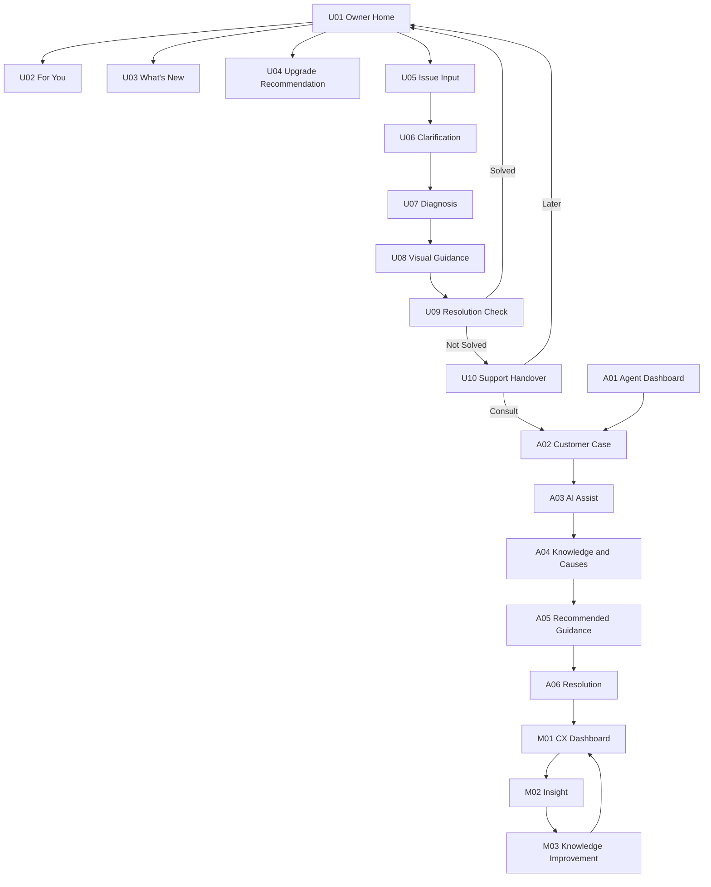
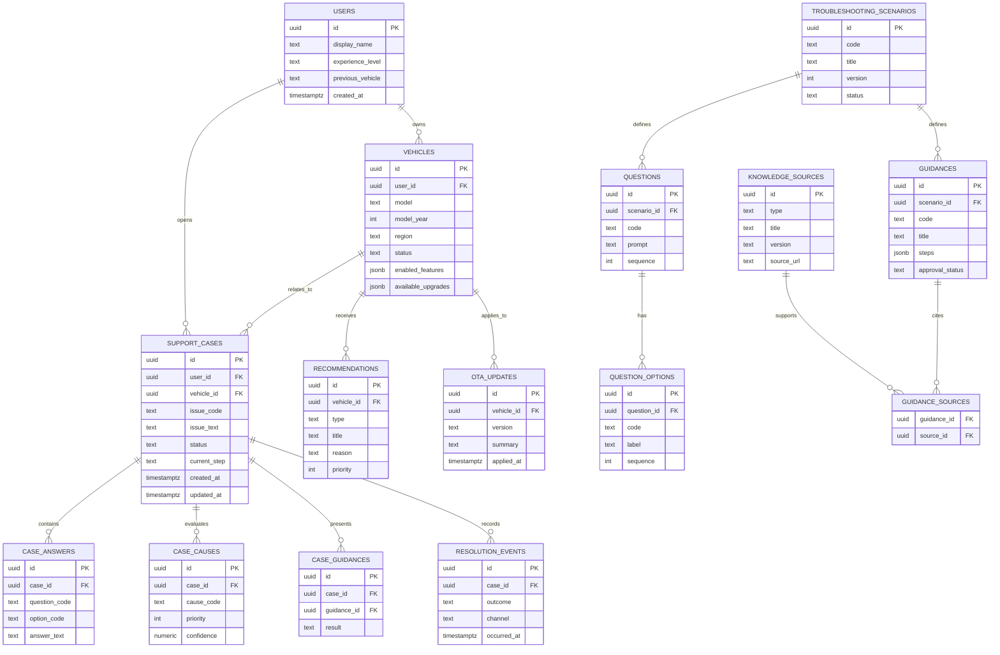
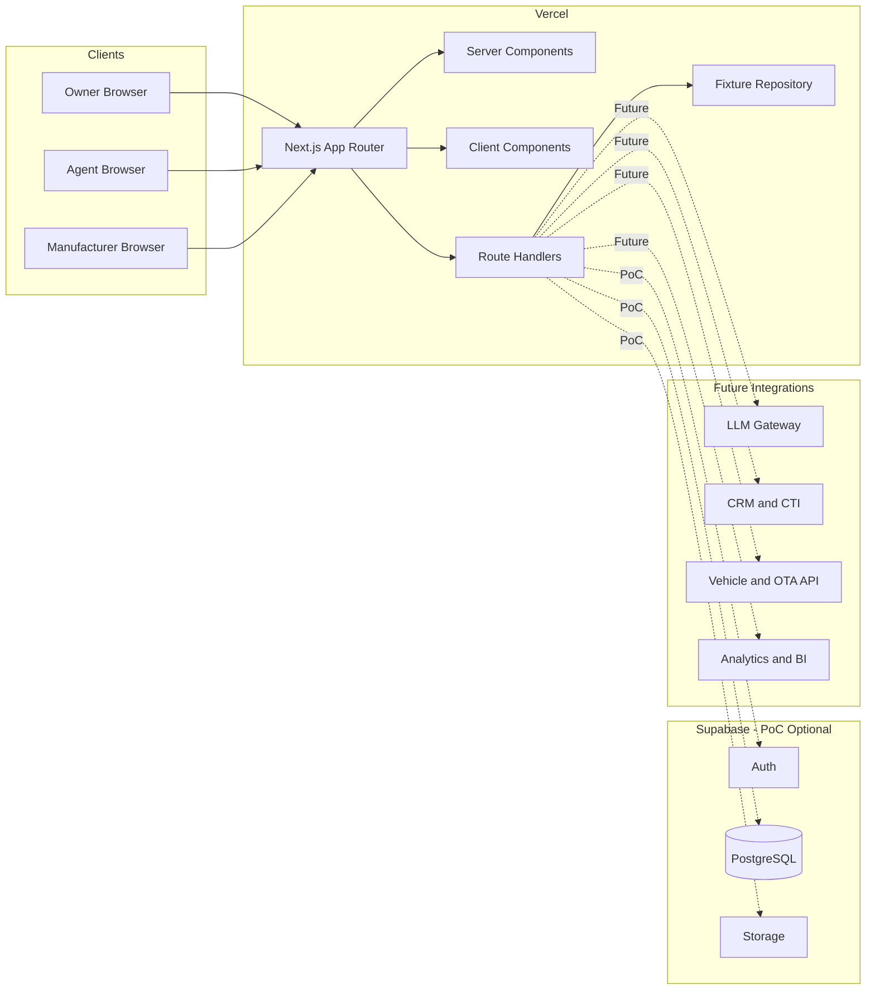
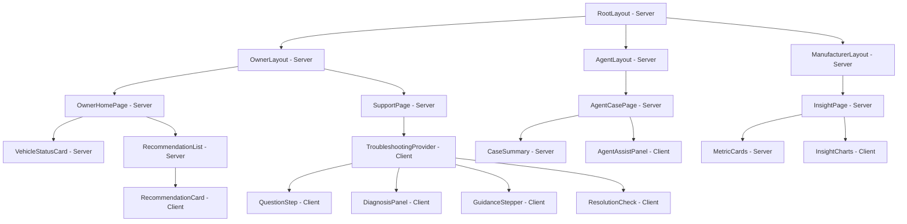

# コンシェルジュAPP（デジOM）詳細要件定義書

| 項目 | 内容 |
|---|---|
| 文書名 | コンシェルジュAPP（デジOM）詳細要件定義書 |
| 文書バージョン | 0.1 |
| 作成日 | 2026-08-10 |
| 対象 | ショールームデモ用モック |
| ステータス | Draft |
| 主要入力 | `docs/output/system_requirements.md` |

> **文書構成に関する注記:** 指定された `docs/template/Requirements_Specification_Template.md` は作成時点で存在しないため、プロンプトに列挙された第1章〜第13章をテンプレート構造として補完した。テンプレート入手後に見出し・管理項目の再マッピングが必要である。

## 1. プロジェクト概要

### 1.1 背景

従来のデジタルオーナーズマニュアルやAIチャットは、ユーザーが課題を認識し、適切な検索語で質問できることを前提としている。一方、車両機能、OTAによる変更、設定状況、利用可能なサービスは複雑化しており、ユーザーが情報の存在自体を知らない場合や、回答を読んでも解決まで到達できない場合がある。また、自己解決できずコールセンターへ移行すると、状況説明と確認作業が繰り返される。

本プロジェクトでは、製品情報、車両情報、ユーザー文脈、問い合わせ・解決履歴を組み合わせ、「SearchからFitへ、回答から解決へ」を体験できるショールーム向けモックを開発する。

### 1.2 目的

- ユーザーが検索しなくても、現在の状況に合う情報・機能・サービスが届く体験を示す。
- 困りごとに対し、追加質問、原因候補、視覚的手順、解決確認までを一貫して支援する。
- 未解決時の情報をコールセンターへ引き継ぎ、説明の重複を減らす体験を示す。
- Owner UIとAgent UIが同一のTroubleshooting / Guidance Engineを共有する価値を示す。
- 利用・解決ログがメーカーの情報改善へ還流する将来像を示す。
- デモ後に単一の顧客課題を対象としたPoC協議へ接続する。

### 1.3 プロジェクトスコープ

#### 対象

- モバイル向けOwner Concierge UI
- PC向けAgent Assist UI
- PC向けCX Intelligence UI
- 固定デモデータを利用するContext、Recommendation、Troubleshootingロジック
- 「後席のドアが開かない」を中心とする決定論的シナリオ
- OwnerからAgentへのケース引き継ぎ
- OTA、新機能、アップグレード推薦、改善インサイトのデモ
- シナリオ初期化、Scene直接移動などのデモ運営機能

#### 対象外

- 実車、OTA、CRM/CTI、販売店、課金システムとの実接続
- 本番認証、本人確認、決済、契約、実際の有人チャット・通話
- 実在人物・実車両データの保存
- 生成AIによる故障や安全状態の確定診断
- 多車種・多言語への完全対応

### 1.4 成果物

- Next.js Webアプリケーション
- 固定シナリオ・モックデータ
- UIコンポーネントおよび共通ドメインロジック
- 単体テスト・主要シナリオE2Eテスト
- Vercel配備環境、ローカル実行手順、デモ復旧手順
- 10〜15分のデモ台本

### 1.5 制約と仮定

- (仮定) 2〜3名のチーム、4〜6週間で開発する。
- (仮定) 同時利用は最大10セッションとする。
- (仮定) 日本語を基本とし、英語は見出し等の演出に限定する。
- (仮定) 対象車種はbZ4X相当のデモ車両だが、正式な車種・年式・地域仕様は未確定である。
- 正式な操作手順は対象マニュアルと製品責任者の承認後に確定する。
- AIは完全モックを第一候補とし、外部LLMはMVP必須要件としない。

## 2. ビジネス要件

### 2.1 リーンキャンバス要約

| 項目 | 要約 |
|---|---|
| 顧客セグメント | 自動車メーカーのCX・アフターサービス・デジタル企画部門、コールセンター運営部門、車両オーナー |
| 課題 | 情報を検索できない、回答から解決に至らない、有人引き継ぎで説明が重複する、問い合わせログが情報改善に活用されない |
| 独自価値提案 | 製品情報・ユーザー文脈・AIを組み合わせ、OwnerとAgent双方の「次にすべきこと」を共通基盤で支援する |
| ソリューション | プロアクティブ推薦、段階的トラブルシューティング、視覚ガイド、有人引き継ぎ、CX改善分析 |
| チャネル | CMCショールーム、顧客向け提案、単一課題PoC |
| 収益 | (仮定) モック／PoC開発費、情報基盤構築費、システム導入費、保守・改善支援費 |
| コスト | UI開発、ナレッジ整備、AI・クラウド、製品情報検証、連携開発、運用・監視 |
| 主要指標 | デモ完走率、PoC協議化率、自己解決率、平均処理時間、根拠提示精度、満足度 |
| 競争優位 | Owner・Agent・Manufacturerを共通情報基盤と共通ロジックで接続し、情報改善まで循環させる設計力 |

### 2.2 KGI

| ID | KGI | 目標 | 判定時点 |
|---|---|---|---|
| KGI-01 | ショールームデモからPoC具体協議へ移行 | (仮定) 対象顧客の30%以上 | デモ後3か月 |
| KGI-02 | One Customer Issue PoCの有効性確認 | 合意した主要KPIのうち3項目以上を改善 | PoC終了時 |
| KGI-03 | CMCの提案領域拡張 | AIチャット単体でなく、情報基盤・Owner・Agent・改善分析を含む提案として承認 | 提案審査時 |

### 2.3 KPI

#### モック／デモKPI

| ID | KPI | 目標 |
|---|---|---|
| KPI-D01 | 主要デモフロー完走率 | 100% |
| KPI-D02 | 1回のデモ所要時間 | 10〜15分 |
| KPI-D03 | 連続リハーサル成功 | 3回連続で重大障害なし |
| KPI-D04 | コンセプト理解 | (仮定) 視聴者の80%以上が「検索との差」「解決までの支援」を説明可能 |
| KPI-D05 | 主要画面操作応答 | 1秒以内 |

#### PoC KPI候補

- 対象問い合わせの自己解決率
- 正しい根拠情報の提示率
- タスク完了率
- Agentの平均処理時間
- 再問い合わせ率
- Owner／Agent満足度
- エスカレーション率

目標値は現状値が未提示のため、PoC開始前のベースライン取得後に確定する。

### 2.4 ビジネスルール

- BR-01: 安全・故障に関する候補は確定診断として表示しない。
- BR-02: 推薦には推薦理由と車両への適合可否を必ず表示する。
- BR-03: 解決率等のモック数値には「デモデータ」と明記する。
- BR-04: OwnerからAgentへ渡す情報は、Ownerが確認した内容と一致しなければならない。
- BR-05: 正式な車両手順は車種・年式・地域仕様・マニュアル版に紐付ける。
- BR-06: 未解決の場合は自己解決を強制せず、有人支援の選択肢を提示する。

## 3. ユーザー要件

### 3.1 ペルソナ

#### P-01 車両オーナー：佐藤 美咲

- 35歳、納車から1か月、EVは初めて。
- スマートフォン利用には慣れているが、車両用語には詳しくない。
- 取扱説明書を最初から読む時間はなく、困った場面で短く確実な案内を求める。
- 知らない便利機能やOTA変更は、自分に関係するものだけ知りたい。
- サポートへ相談する場合、同じ説明を繰り返したくない。

#### P-02 コールセンター担当者：田中 健

- 42歳、オペレーター経験2年。
- 車種・年式ごとの差分と膨大なマニュアルから適切な回答を探すことに負担を感じている。
- 顧客の感情に配慮しながら、短時間で状況を切り分けたい。
- AIには回答の自動送信ではなく、次の質問、原因候補、根拠、回答トークの支援を期待する。

### 3.2 ユーザーストーリー

| ID | ユーザーストーリー | 受入条件 |
|---|---|---|
| US-01 | 車両オーナーとして、質問しなくても自分に必要な設定や変更を知りたい。 | 車種・利用状況に対応するカードと推薦理由がHomeに表示される |
| US-02 | 車両オーナーとして、困りごとを短い質問に答えながら解決したい。 | 1問ずつ状況確認され、回答に対応する原因候補と手順へ到達できる |
| US-03 | 車両オーナーとして、操作箇所を画像と短い手順で確認したい。 | 最大3〜5ステップ、対象箇所ハイライト、前後移動が提供される |
| US-04 | 車両オーナーとして、未解決時に確認済み内容をサポートへ渡したい。 | ケース要約を確認後、Agent画面に同一情報が表示される |
| US-05 | Agentとして、次に聞く質問と根拠を確認し、正確な案内をしたい。 | Next Best Question、原因候補、回答トーク、情報源が表示される |

### 3.3 MVP定義

MVPは以下の一気通貫フローとする。

1. Owner Homeでプロアクティブ推薦を確認する。
2. 「後席のドアが開かない」を入力する。
3. 「どこから」「どのドア」を回答する。
4. 原因候補と視覚的ガイドを確認する。
5. 未解決を選択し、引き継ぎ要約を確認する。
6. Agent UIで確認済み内容、次の質問、原因候補、根拠を確認する。
7. 対応結果を記録する。

MVPには実AI、実データ連携、CX Intelligence、決済、音声認識を含めない。OTA、Upgrade、CX画面はMVP後の差別化Sceneとする。

## 4. 機能要件

### 4.1 機能一覧

| ID | 機能 | 概要 | MoSCoW |
|---|---|---|---|
| FR-01 | Owner Home | 車両状態と優先情報をカード表示 | Must |
| FR-02 | パーソナライズ推薦 | 文脈に応じた推薦と理由表示 | Must |
| FR-03 | OTA / What's New | 個別化した変更点表示 | Should |
| FR-04 | Upgrade Recommendation | 適合サービスと推薦理由表示 | Should |
| FR-05 | 困りごと入力 | 定型入力、候補チップ、入力補完 | Must |
| FR-06 | 状況確認・診断 | 逐次質問と原因候補判定 | Must |
| FR-07 | Visual Guidance | 画像・ハイライト・段階手順 | Must |
| FR-08 | 解決確認 | 解決結果記録と次導線 | Must |
| FR-09 | Support Handover | ケース要約とAgentへの共有 | Must |
| FR-10 | Agent Assist | 次質問、原因、回答、根拠表示 | Must |
| FR-11 | CX Intelligence | 解決傾向と改善提案表示 | Should |
| FR-12 | デモ運営 | リセット、Scene直接遷移 | Must |
| FR-13 | 音声入力 | 音声による困りごと入力 | Could |
| FR-14 | 実LLM連携 | 自由入力の意図分類 | Won't（今回） |
| FR-15 | 外部業務連携 | CRM/CTI/実車との連携 | Won't（今回） |

### 4.2 機能詳細仕様：状況確認・トラブルシューティング

#### 4.2.1 ユースケース

| 項目 | 内容 |
|---|---|
| ユースケースID | UC-TS-01 |
| アクター | 車両オーナー |
| 事前条件 | デモユーザーと車両が選択済み |
| トリガー | 困りごと「後ろのドアが開かない」を送信 |
| 事後条件 | 解決結果または引き継ぎ可能なケースが生成される |

#### 4.2.2 正常系フロー

1. システムは入力を`troubleshooting`意図、`rear_door_not_open`症状として識別する。
2. 「どこから開けようとしていますか？」を表示する。
3. ユーザーが「車内から」を選択する。
4. 「どのドアですか？」を表示する。
5. ユーザーが「左後席」を選択する。
6. システムは回答ルールを評価し、チャイルドプロテクターを第1候補として表示する。
7. 3ステップのVisual Guidanceを表示する。
8. 「解決しましたか？」を表示する。
9. 「はい」を選ぶと結果を`solved`として記録し、Homeへの導線を表示する。

#### 4.2.3 代替・例外系

- 入力が対象外の場合、対応可能なサンプル質問を表示し、シナリオへ誘導する。
- 必須回答が未選択の場合、「選択してください」をインライン表示する。
- シナリオ定義が欠落した場合、固定の安全な案内と運営者向けエラーコードを表示する。
- 「まだ開きません」の場合、結果を`not_solved`として記録し、Support Handoverへ進む。
- ブラウザ再読み込み時は、(仮定) セッションストレージから直前ステップを復元する。
- 安全関連キーワード検知時は通常フローを中断し、緊急案内を表示する。ただし今回のモックでは代表パターンのみとする。

#### 4.2.4 判定ルール

```text
issue = rear_door_not_open
AND opening_from = inside
AND door_position IN (left_rear, right_rear, both_rear)
THEN primary_cause = child_protector
     guidance = check_child_protector
```

- ルールは優先度昇順、同一優先度では定義順で評価する。
- 原因候補、質問、ガイド、根拠はIDで関連付ける。
- UI内に条件分岐を直接埋め込まない。

#### 4.2.5 UI要件

- 1画面1質問とし、選択肢は44px以上のボタンで表示する。
- 現在の進行状況を「確認 1/2」等で表示する。
- 戻る操作で回答を修正でき、後続の回答・診断結果を再計算する。
- 原因は「可能性があります」と表示し、断定しない。

#### 4.2.6 受入条件

- 定義済み回答の組合せで常に同じ診断結果になる。
- 戻って回答を変更すると診断結果が再評価される。
- 解決／未解決がSupportCaseに保存される。
- OwnerとAgentで同じケース内容が表示される。

### 4.3 機能詳細仕様：Support Handover

#### 4.3.1 ユースケース

| 項目 | 内容 |
|---|---|
| ユースケースID | UC-HO-01 |
| アクター | 車両オーナー、コールセンター担当者 |
| 事前条件 | トラブルシューティング結果が`not_solved` |
| トリガー | ユーザーが「相談する」を選択 |
| 事後条件 | Agent UIから同一ケースを参照可能 |

#### 4.3.2 正常系フロー

1. システムは車両、症状、回答、確認済み項目、案内、結果を要約する。
2. Ownerが要約を確認する。
3. Ownerが「相談する」を選択する。
4. ケース状態を`escalated`に更新する。
5. Agent Customer Caseへ遷移し、同一ケースIDの情報を表示する。

#### 4.3.3 例外系

- 必須情報が欠落している場合、「未確認」と表示し、推測で補完しない。
- Agent側でケースが取得できない場合、再試行とデモ初期化を提示する。
- Ownerが「あとで」を選択した場合、`not_solved`のままHomeへ戻る。

#### 4.3.4 UI要件

- 要約はVehicle、Issue、Condition、Already Checked、Guidance、Resultの順とする。
- 送信前に内容を閲覧できる。
- モックでは「実際のサポートには送信されません」と明記する。

#### 4.3.5 受入条件

- OwnerとAgentのケースID、車両、回答、確認項目、結果が一致する。
- 未確認項目が確認済みとして表示されない。
- 初期化後は以前のデモケースが表示されない。

### 4.4 機能詳細仕様：Agent Assist

#### 4.4.1 ユースケース

| 項目 | 内容 |
|---|---|
| ユースケースID | UC-AA-01 |
| アクター | コールセンター担当者 |
| 事前条件 | エスカレーション済みケースが存在 |
| トリガー | Agentがケースを開く |
| 事後条件 | 次質問または案内を実施し、結果を記録 |

#### 4.4.2 正常系フロー

1. 左ペインに顧客、車両、Issue、履歴、確認済み項目を表示する。
2. 右ペインにNext Best Questionと理由を表示する。
3. 回答に応じてPossible Causesの順序を再評価する。
4. Recommended Guidanceと回答トークを表示する。
5. AgentはOwner's Manual、FAQ、Past Support Caseの根拠を確認する。
6. 結果を解決、未解決、Dealer、Technical Supportから選択して保存する。

#### 4.4.3 例外系

- 根拠がない候補は表示しない。
- 対応外の回答では「追加情報が必要」とし、確定的な案内を生成しない。
- 保存失敗時は入力状態を保持し、再試行を表示する。

#### 4.4.4 UI要件

- 1280px以上で2カラムを維持する。
- Next Best Questionを右ペイン上部の最重要領域に置く。
- 原因候補に順位、確度表現、根拠リンクを付ける。
- AI提案とAgentが確定した対応内容を視覚的に区別する。

## 5. UI/UX設計

### 5.1 デザインコンセプト

- **キーワード:** Premium、Minimal、Contextual、Trustworthy
- **原則:** 状態 → 次の行動 → 理由の順に提示する。
- **Owner:** モバイルファースト、大きな余白、カードベース、1画面1判断。
- **Agent:** 情報密度を保ちながら、次の質問と根拠へ即時アクセスできる2カラム。
- **文体:** 短く、平易で、安心感があり、断定し過ぎない。

### 5.2 カラーパレット（仮定）

| 用途 | 色 | HEX |
|---|---|---|
| Primary | Deep Navy | `#102A43` |
| Accent | Electric Blue | `#2F80ED` |
| Background | Cool White | `#F7F9FC` |
| Surface | White | `#FFFFFF` |
| Success | Green | `#17864B` |
| Attention | Amber | `#B76E00` |
| Danger | Red | `#C62828` |
| Main Text | Charcoal | `#172B4D` |
| Secondary Text | Slate | `#5E6C84` |

- 正式なブランドガイド入手後に置換する。
- 本文・背景のコントラストはWCAG 2.2 AA相当を満たす。
- 状態表現を色だけに依存させず、文言とアイコンを併用する。

### 5.3 タイポグラフィ（仮定）

- 日本語: `"Noto Sans JP", system-ui, sans-serif`
- 英数字: `"Inter", "Noto Sans JP", sans-serif`
- Display: 28px / 700
- Heading 1: 24px / 700
- Heading 2: 20px / 700
- Body: 16px / 400
- Caption: 13px / 400
- Agent UI Body: 14〜16px

### 5.4 画面一覧

| ID | 画面名 | 対象 | 目的 |
|---|---|---|---|
| U01 | Home | Owner | 車両状態とプロアクティブ情報 |
| U02 | For You | Owner | 個別推薦一覧・理由 |
| U03 | What's New | Owner | OTA・新機能の変更点 |
| U04 | Upgrade Recommendation | Owner | サービス推薦 |
| U05 | Ask / Issue Input | Owner | 困りごと入力 |
| U06 | Clarification | Owner | 状況確認 |
| U07 | Diagnosis | Owner | 原因候補 |
| U08 | Visual Guidance | Owner | 視覚的な操作案内 |
| U09 | Resolution Check | Owner | 解決結果確認 |
| U10 | Support Handover | Owner | 有人支援への情報引き継ぎ |
| A01 | Agent Dashboard | Agent | 問い合わせ一覧 |
| A02 | Customer Case | Agent | 顧客・車両・ケース情報 |
| A03 | AI Assist | Agent | 次質問と理由 |
| A04 | Knowledge / Cause | Agent | 原因候補と根拠 |
| A05 | Recommended Guidance | Agent | 回答トークと案内 |
| A06 | Resolution | Agent | 対応結果記録 |
| M01 | CX Dashboard | Manufacturer | 問い合わせ・解決状況 |
| M02 | Insight | Manufacturer | 問題傾向と改善点 |
| M03 | Knowledge Improvement | Manufacturer | 情報改善候補 |

### 5.5 画面遷移図



### 5.6 テキストワイヤーフレーム

#### U01 Owner Home

```text
┌────────────────────────────────┐
│ Good afternoon          [Menu] │
│                                │
│ MY CAR                         │
│ ┌────────────────────────────┐ │
│ │ bZ4X        All Good  ●    │ │
│ │ Vehicle image / status     │ │
│ └────────────────────────────┘ │
│                                │
│ FOR YOU                        │
│ ┌────────────────────────────┐ │
│ │ おすすめ                    │ │
│ │ 充電スケジュールを設定する  │ │
│ │ 納車後に便利です       [>] │ │
│ └────────────────────────────┘ │
│                                │
│ WHAT'S NEW                     │
│ ┌────────────────────────────┐ │
│ │ Update completed / 2件 [>] │ │
│ └────────────────────────────┘ │
│                                │
│ [ 困りごとを相談する ]         │
│ Ask anything                   │
└────────────────────────────────┘
```

#### U08 Visual Guidance

```text
┌────────────────────────────────┐
│ [<] 30秒で確認できます   1 / 3 │
│                                │
│ ┌────────────────────────────┐ │
│ │                            │ │
│ │  Vehicle / Door image      │ │
│ │  Left rear highlighted     │ │
│ │                            │ │
│ └────────────────────────────┘ │
│ STEP 1                         │
│ 後席ドアを開けます             │
│                                │
│ [ 戻る ]              [ 次へ ] │
└────────────────────────────────┘
```

#### A02〜A05 Agent Case

```text
┌──────────────────────┬─────────────────────────────────┐
│ CUSTOMER / CASE      │ AI ASSIST                       │
│ Demo User            │ NEXT BEST QUESTION              │
│ bZ4X                 │ 車外から開けられますか？         │
│                      │ 理由: 原因候補の切り分け         │
│ ISSUE                ├─────────────────────────────────┤
│ 後席ドアが開かない    │ POSSIBLE CAUSES                 │
│                      │ 1. Child Protector              │
│ CHECKED              │ 2. Door Lock Setting            │
│ ✓ 車内から            ├─────────────────────────────────┤
│ ✓ 左後席              │ RECOMMENDED GUIDANCE            │
│ ✓ ガイド実施          │ 顧客向け回答トーク              │
│                      ├─────────────────────────────────┤
│ HISTORY              │ EVIDENCE                        │
│ ...                  │ Manual / FAQ / Past Case        │
└──────────────────────┴─────────────────────────────────┘
```

## 6. 非機能要件

### 6.1 性能

| ID | 要件 | 基準 |
|---|---|---|
| NFR-P01 | 初回画面表示 | 通常回線で3秒以内 |
| NFR-P02 | 画面操作応答 | 1秒以内 |
| NFR-P03 | 初回転送量 | 主要ページ3MB以内を目安 |
| NFR-P04 | 同時利用 | 最大10セッション（仮定） |

### 6.2 可用性・信頼性

- 外部APIなしでMVPシナリオを完走できる。
- デモリハーサルを3回連続で完走できる。
- Vercelまたは回線障害に備え、ローカル実行または静的バックアップを用意する。
- 誤操作から2操作以内で既定Sceneへ復帰できる。
- データ・表示順・判定結果は実行ごとに変動しない。

### 6.3 セキュリティ・プライバシー

- モックには架空データのみを使用する。
- 秘密情報は環境変数で管理し、GitおよびClient Componentへ含めない。
- Supabaseを使用する場合、Row Level Securityを全公開テーブルで有効化する。
- PoCではRBAC、監査ログ、暗号化、同意、保持・削除、テナント分離を設計する。
- 外部LLMには個人情報・機密情報を送信しない。

### 6.4 正確性・安全性

- 操作案内は車種、年式、地域、マニュアル版、承認状態を追跡可能にする。
- 原因候補は「可能性」として表示し、確定診断としない。
- 緊急性の高い入力は自己解決より緊急案内を優先する。
- 未承認ナレッジをユーザー向け案内に使用しない。

### 6.5 ユーザビリティ・アクセシビリティ

- Owner UI対象幅: 360〜430px。
- Agent UI対象幅: 1280px以上。
- タップ領域: 44px以上。
- 本文: 16px相当以上を基本とする。
- WCAG 2.2 AA相当のコントラスト、キーボード操作、フォーカス表示、代替テキストに対応する。
- `prefers-reduced-motion`を尊重する。

### 6.6 保守性・テスト

- TypeScript `strict: true`を使用する。
- UI、データ、エンジン、型を分離する。
- 共通診断ロジックをOwner／Agentで重複実装しない。
- エンジン・状態遷移の単体テスト、主要フローのPlaywright E2Eを実装する。
- ESLint、型チェック、テスト、ビルドをCIで実行する。

### 6.7 対応環境

- Windows 11上の最新安定版Chrome、Edge。
- 最新iOS Safari、Android Chrome相当のレスポンシブ表示。
- JavaScript有効環境を前提とする。

## 7. データベース設計

### 7.1 方針

- モックMVPでは同一構造のTypeScript/JSON fixtureを利用し、DBを必須としない。
- PoCではSupabase PostgreSQLへ移行できる論理モデルとする。
- UUID、`timestamptz`、JSONBを利用しつつ、検索・集計対象項目は正規化する。
- 実ユーザーを扱う場合、PIIと利用・解決ログを論理的に分離する。

### 7.2 ER図



### 7.3 主要テーブル定義

#### `support_cases`

| カラム | 型 | Null | 制約・説明 |
|---|---|---|---|
| id | uuid | No | PK、`gen_random_uuid()` |
| user_id | uuid | No | FK `users.id` |
| vehicle_id | uuid | No | FK `vehicles.id` |
| issue_code | text | No | 対象シナリオ識別子 |
| issue_text | text | No | ユーザー入力 |
| status | text | No | `in_progress`, `solved`, `not_solved`, `escalated` |
| current_step | text | Yes | 現在の質問・画面 |
| created_at | timestamptz | No | default `now()` |
| updated_at | timestamptz | No | 更新時に変更 |

インデックス: `(vehicle_id, created_at desc)`、`(status, updated_at desc)`。

#### `case_answers`

| カラム | 型 | Null | 制約・説明 |
|---|---|---|---|
| id | uuid | No | PK |
| case_id | uuid | No | FK `support_cases.id`, ON DELETE CASCADE |
| question_code | text | No | 質問コード |
| option_code | text | Yes | 選択肢コード |
| answer_text | text | Yes | 自由記述 |

一意制約: `(case_id, question_code)`。

#### `troubleshooting_scenarios`

| カラム | 型 | Null | 制約・説明 |
|---|---|---|---|
| id | uuid | No | PK |
| code | text | No | Unique |
| title | text | No | シナリオ名 |
| version | integer | No | 1以上 |
| status | text | No | `draft`, `approved`, `retired` |

#### `guidances`

| カラム | 型 | Null | 制約・説明 |
|---|---|---|---|
| id | uuid | No | PK |
| scenario_id | uuid | No | FK |
| code | text | No | シナリオ内でUnique |
| title | text | No | ガイド名 |
| steps | jsonb | No | 手順、画像、注意事項 |
| approval_status | text | No | `draft`, `reviewed`, `approved` |

`steps`はスキーマ検証し、`approved`以外はOwner向け本番表示に使用しない。

#### `resolution_events`

| カラム | 型 | Null | 制約・説明 |
|---|---|---|---|
| id | uuid | No | PK |
| case_id | uuid | No | FK |
| outcome | text | No | `solved`, `not_solved`, `need_info`, `escalated` |
| channel | text | No | `owner`, `call_center`, `dealer` |
| occurred_at | timestamptz | No | default `now()` |

## 8. インテグレーション要件

### 8.1 外部サービス候補

| 連携先 | モック | PoC以降 | 目的 |
|---|---|---|---|
| Supabase Auth | 不要 | 候補 | Owner、Agent、Manufacturer認証 |
| Supabase PostgreSQL | fixtureで代替 | 候補 | ケース、ナレッジ、ログ |
| Supabase Storage | ローカル素材 | 候補 | 画像・動画・マニュアル素材 |
| LLM Gateway | 固定応答 | 候補 | 意図分類、質問・要約生成 |
| Vector Search | 不要 | 候補 | マニュアル・FAQ検索 |
| CRM/CTI | 画面遷移で代替 | 将来 | ケース・通話引き継ぎ |
| Vehicle/OTA API | fixtureで代替 | 将来 | 車両状態・更新情報 |
| Analytics/BI | デモ値 | 候補 | CXイベント分析 |

### 8.2 API共通仕様

- Base URL: `/api/v1`
- Content-Type: `application/json`
- 文字コード: UTF-8
- 認証: モックでは不要、PoCではBearer JWT
- エラー形式:

```json
{
  "error": {
    "code": "SCENARIO_NOT_FOUND",
    "message": "対象シナリオが見つかりません。",
    "requestId": "req_01..."
  }
}
```

### 8.3 ケース作成

`POST /api/v1/support-cases`

リクエスト:

```json
{
  "userId": "0d145c23-42a5-4dce-90bb-f0248715d737",
  "vehicleId": "f69d8d26-9a30-490a-8534-3554ec11c27c",
  "issueText": "後ろのドアが開かない"
}
```

レスポンス `201 Created`:

```json
{
  "id": "b143d269-9d4f-4bc8-b900-33238678a593",
  "issueCode": "rear_door_not_open",
  "status": "in_progress",
  "nextQuestion": {
    "code": "opening_from",
    "prompt": "どこから開けようとしていますか？",
    "options": [
      { "code": "inside", "label": "車内から" },
      { "code": "outside", "label": "車外から" },
      { "code": "both", "label": "どちらからも" }
    ]
  }
}
```

### 8.4 質問回答

`POST /api/v1/support-cases/{caseId}/answers`

リクエスト:

```json
{
  "questionCode": "opening_from",
  "optionCode": "inside"
}
```

レスポンス `200 OK`:

```json
{
  "caseId": "b143d269-9d4f-4bc8-b900-33238678a593",
  "nextQuestion": {
    "code": "door_position",
    "prompt": "どのドアですか？",
    "options": [
      { "code": "left_rear", "label": "左後席" },
      { "code": "right_rear", "label": "右後席" },
      { "code": "both_rear", "label": "両方" }
    ]
  },
  "diagnosis": null
}
```

全質問完了時は`nextQuestion: null`とし、`diagnosis`に候補とガイドIDを返す。

### 8.5 解決結果登録

`POST /api/v1/support-cases/{caseId}/resolution`

リクエスト:

```json
{
  "outcome": "not_solved",
  "channel": "owner",
  "guidanceCode": "check_child_protector"
}
```

レスポンス `200 OK`:

```json
{
  "caseId": "b143d269-9d4f-4bc8-b900-33238678a593",
  "status": "not_solved",
  "handoverAvailable": true
}
```

### 8.6 引き継ぎ要約取得

`GET /api/v1/support-cases/{caseId}/handover`

レスポンス `200 OK`:

```json
{
  "caseId": "b143d269-9d4f-4bc8-b900-33238678a593",
  "vehicle": { "model": "bZ4X", "modelYear": 2026 },
  "issue": "後席ドアが開かない",
  "conditions": ["車内から開かない", "左後席"],
  "checkedItems": ["チャイルドプロテクター", "ドアロック状態"],
  "guidance": "チャイルドプロテクター確認手順",
  "result": "未解決"
}
```

### 8.7 非同期・障害要件

- 外部サービス呼び出しはタイムアウトを3秒以内に設定する（仮定）。
- LLM失敗時は固定シナリオへフォールバックする。
- 同一の結果登録は冪等キーにより重複イベントを防ぐ。
- APIログへ自由入力全文や個人情報を無条件に記録しない。

## 9. 技術選定とアーキテクチャ

### 9.1 技術スタック

| レイヤー | 技術 | 選定理由 |
|---|---|---|
| Web | Next.js App Router / React | 複数UI、Server Components、Vercel統合 |
| 言語 | TypeScript | 共通型、実装時エラー削減 |
| UI | Tailwind CSS | 短期開発、デザイントークン統一 |
| 状態管理 | React Context + `useReducer` | 単一デモケースの明示的状態遷移 |
| BaaS | Supabase | PoC時のAuth、PostgreSQL、Storage統合 |
| ホスティング | Vercel | Next.jsとの親和性、プレビュー配備 |
| テスト | Vitest / Testing Library / Playwright | ロジック、UI、E2Eの分担 |

モックMVPではSupabaseの障害がデモへ影響しないよう、Repository Interfaceのfixture実装を標準とする。SupabaseはPoC構成とアーキテクチャ検証用のオプションとする。

### 9.2 アーキテクチャ概要図



### 9.3 App Router構成

```text
src/
├─ app/
│  ├─ owner/
│  │  ├─ page.tsx
│  │  ├─ whats-new/page.tsx
│  │  ├─ upgrade/page.tsx
│  │  └─ support/[caseId]/
│  │     ├─ clarify/page.tsx
│  │     ├─ diagnosis/page.tsx
│  │     ├─ guidance/page.tsx
│  │     ├─ resolution/page.tsx
│  │     └─ handover/page.tsx
│  ├─ agent/
│  │  ├─ page.tsx
│  │  └─ cases/[caseId]/page.tsx
│  ├─ manufacturer/
│  │  └─ insights/page.tsx
│  └─ api/v1/support-cases/
├─ components/
│  ├─ owner/
│  ├─ agent/
│  ├─ troubleshooting/
│  └─ ui/
├─ domain/
│  ├─ context/
│  ├─ recommendation/
│  └─ troubleshooting/
├─ repositories/
│  ├─ fixture/
│  └─ supabase/
├─ data/fixtures/
└─ types/
```

### 9.4 コンポーネント階層図



### 9.5 主要コンポーネント仕様

#### `QuestionStep` — Client Component

```typescript
type QuestionOption = {
  code: string;
  label: string;
};

type QuestionStepProps = {
  questionCode: string;
  prompt: string;
  options: QuestionOption[];
  selectedCode?: string;
  progress: { current: number; total: number };
  onAnswer: (questionCode: string, optionCode: string) => void;
  onBack?: () => void;
};
```

- 選択、戻る、入力エラーを扱うためClient Componentとする。
- ケース全体の状態は`TroubleshootingProvider`の`useReducer`で管理する。
- 選択肢ボタンはキーボード操作とARIAラベルに対応する。

#### `GuidanceStepper` — Client Component

```typescript
type GuidanceStep = {
  id: string;
  title: string;
  body: string;
  imageUrl?: string;
  imageAlt?: string;
  warning?: string;
};

type GuidanceStepperProps = {
  title: string;
  steps: GuidanceStep[];
  onComplete: () => void;
};
```

- 現在ステップのみローカル`useState<number>`で保持する。
- ケース・診断結果はContextから参照し、手順データ自体はPropsで受け取る。
- 画像には必須の代替テキストを設定する。

#### `AgentAssistPanel` — Client Component

```typescript
type CauseCandidate = {
  code: string;
  label: string;
  priority: number;
  confidenceLabel?: "high" | "medium" | "low";
  evidenceIds: string[];
};

type AgentAssistPanelProps = {
  caseId: string;
  nextQuestion?: {
    prompt: string;
    reason: string;
  };
  causes: CauseCandidate[];
  recommendedTalk: string;
  onResolve: (outcome: "solved" | "not_solved" | "dealer" | "technical_support") => void;
};
```

- Agentの選択・結果登録があるためClient Componentとする。
- 初期データ取得と権限確認は親Server Componentで行う。
- モックでは`useState`、PoCで複数領域から更新する場合のみ軽量ストアを検討する。

### 9.6 Server / Client方針

- データ取得、秘密情報、初期権限確認、静的カードはServer Componentを基本とする。
- ユーザー操作、状態遷移、アニメーション、ブラウザAPI利用箇所のみClient Componentとする。
- `"use client"`をページ最上位へ安易に付けず、対話部品の境界まで下げる。
- 更新はRoute HandlerまたはServer Actionのどちらかに統一する。REST API公開要件があるため、本書ではRoute Handlerを標準とする。

## 10. リスクと課題

| ID | 分類 | リスク／課題 | 影響 | 発生可能性 | 対策 |
|---|---|---|---|---|---|
| R-01 | 安全 | 車種・年式に合わない操作案内 | 高 | 中 | 正式マニュアル、版管理、製品責任者承認 |
| R-02 | 技術 | 外部AI・API障害でデモ停止 | 高 | 中 | 固定シナリオ、タイムアウト、フォールバック |
| R-03 | 技術 | 状態分岐が破綻する | 高 | 中 | 状態遷移の明示、単体・E2Eテスト |
| R-04 | 技術 | OwnerとAgentで情報不整合 | 高 | 低 | 共通caseId、共通Repository、契約テスト |
| R-05 | UX | AIチャットにしか見えない | 高 | 中 | Home推薦、理由、解決確認、CX改善を強調 |
| R-06 | 事業 | 将来機能が実装済みに見える | 中 | 中 | モック／PoC／本番の境界表示 |
| R-07 | 事業 | KPIベースラインがなくPoC評価不能 | 高 | 高 | PoC前に現状計測と成功条件合意 |
| R-08 | 法務 | 実データ・AI利用がポリシー違反 | 高 | 中 | 架空データ、事前審査、最小化、契約確認 |
| R-09 | 法務 | ロゴ・車両画像・図版の権利問題 | 高 | 中 | 利用許諾確認、仮素材の利用 |
| R-10 | 運用 | ショールーム端末・回線差 | 高 | 中 | 実機試験、ローカル版、代替動画 |
| R-11 | 運用 | 説明者の操作ミス | 中 | 中 | 台本、Scene移動、初期化、復旧手順 |
| R-12 | 計画 | スコープ膨張 | 高 | 高 | MoSCoW、MVP凍結、変更管理 |

### 10.1 未解決課題

- 対象車種、年式、地域仕様、正式マニュアル版
- 車両操作内容の承認者
- ブランドガイドと利用可能素材
- デモ実施日、予算、チーム構成
- 必須Sceneと削除可能Scene
- ショールーム端末・ネットワーク制約
- PoC対象部門、データ、KPIベースライン、AIポリシー

## 11. ランニング費用と運用方針

### 11.1 費用概算

価格は契約地域、為替、利用量、プラン改定により変動するため、契約時に各社の公式価格を再確認する。

| 項目 | モック想定 | 月額概算 |
|---|---|---|
| Vercel | 小規模配備、1〜3開発者 | 無料枠〜数千円／人（仮定） |
| Supabase | MVPでは未使用、PoCで1プロジェクト | 無料枠〜数千円台（仮定） |
| 独自ドメイン | 任意 | 年額数千円程度（仮定） |
| 監視・分析 | Vercel標準または無料枠 | 0〜数千円（仮定） |
| LLM | MVPでは0、PoCは従量 | 利用量次第。上限設定必須 |
| 素材配信 | Vercel/Supabase Storage | 小規模ではプラン内想定 |

モックの固定データ構成では、クラウド費用より人件費、デザイン・素材制作、車両情報の検証コストが主要コストとなる。

### 11.2 環境

- `local`: 開発、回線断時のデモ
- `preview`: Pull Request単位のレビュー
- `production-demo`: 承認済みデモ版
- PoC移行時に`staging`と`production`を追加する。

### 11.3 運用体制（仮定）

| 役割 | 責務 |
|---|---|
| Product Owner | スコープ、台本、受入判断 |
| Tech Lead | アーキテクチャ、品質、配備 |
| Designer | UI、素材、アクセシビリティ |
| Vehicle/Content Reviewer | 操作案内、根拠、版の承認 |
| Demo Operator | 事前確認、実演、復旧 |

### 11.4 運用手順

- デモ前日: 本番URL、ローカル版、ブラウザ、解像度、初期化を確認する。
- デモ30分前: 主要フローを1回完走し、不要タブ・通知を閉じる。
- デモ後: ケースを初期化し、障害・質問・反応を記録する。
- 変更後: 型チェック、lint、単体テスト、E2E、production buildを実行する。

### 11.5 バックアップ・障害対応

- fixtureと素材をGitで版管理する。
- 承認済みデモタグまたはリリースを保持する。
- Vercel障害時はローカル版、端末障害時は代替端末、最終手段として録画へ切り替える。
- Supabase利用時は提供されるバックアップ仕様と復旧目標を契約プランに合わせて定義する。

## 12. 変更管理

### 12.1 変更要求プロセス

1. 変更要求者が目的、変更内容、希望日、対象Sceneを記載する。
2. Product OwnerとTech Leadが価値、工数、安全性、デモ台本への影響を評価する。
3. Must要件、納期、費用、リスクへの影響がある場合は承認者の合意を得る。
4. 承認後、要件ID、設計、テスト、台本を更新する。
5. Preview環境で受入確認後、production-demoへ反映する。

### 12.2 変更区分

| 区分 | 例 | 承認 |
|---|---|---|
| 軽微 | 文言、余白、誤字 | Product Owner |
| 中 | 画面分岐、素材、データ項目 | Product Owner + Tech Lead |
| 重大 | スコープ、外部連携、安全案内、納期 | プロジェクト責任者 + 製品責任者 |

### 12.3 トレーサビリティ

- 要件は`FR-*`、`NFR-*`、`US-*`、`UC-*`で識別する。
- Pull Requestとテストケースに要件IDを記載する。
- 車両ガイドにはKnowledge Source ID、版、承認者、承認日を記録する。
- 文書変更履歴を以下で管理する。

| Version | Date | Author | Summary |
|---|---|---|---|
| 0.1 | 2026-08-10 | Cursor Agent | 初版作成 |

## 13. 参考資料

### 13.1 プロジェクト資料

- `docs/output/system_requirements.md`
- `docs/input/concierge_app_mock_system_overview.md`
- `prompt/2_detailed_requirements_prompt.md`
- `docs/template/Requirements_Specification_Template.md`（作成時点で未配置）

### 13.2 UI/UX参考

- Apple Support: https://support.apple.com/
- Tesla オーナーズマニュアル: https://www.tesla.com/ownersmanual
- Intercom Fin: https://www.intercom.com/fin

### 13.3 用語集

| 用語 | 定義 |
|---|---|
| Owner Concierge | 車両オーナー向けの情報提示・問題解決UI |
| Agent Assist | コールセンター担当者向け支援UI |
| CX Intelligence | 利用・解決ログを集計し改善示唆を示す機能 |
| Next Best Question | 原因切り分けのため次に確認すべき質問 |
| Troubleshooting Engine | 症状、観察、原因、確認、行動、結果を扱う共通ロジック |
| Guidance Engine | 短文、手順、画像等の適切な案内形式を選ぶロジック |
| Support Handover | 確認済み内容を要約して有人支援へ渡す処理 |
| OTA | Over-The-Airによる車両ソフトウェア更新 |
| Fixture | デモやテストで使う固定データ |
| PoC | 実現性・効果を限定範囲で検証する概念実証 |

### 13.4 承認前に確定すべき事項

1. 正式テンプレートを配置し、本書の章構成を再確認する。
2. 車種・年式・地域仕様・マニュアル版を確定する。
3. 操作案内、安全表現、素材の承認者を確定する。
4. 開発期間、予算、体制、必須Sceneを確定する。
5. モックでSupabaseを実接続するか、fixtureのみとするかを確定する。
